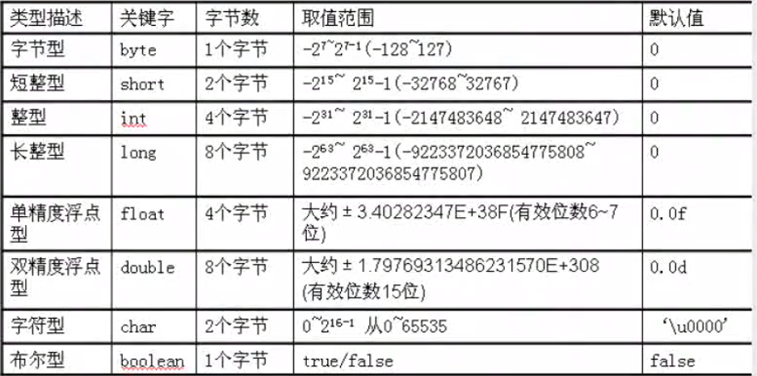

# 1、java介绍
## 1.1、java的加载与执行
1. java程序的运行包括两个非常重要的阶段
  - 编译阶段
  - 运行阶段
2. 编译阶段
  - 编译阶段主要的任务是检查java源程序是否符合java语法，符合java语法则能生成正常的字节码文件，不符合java语法规则无法生成字节码文件
  - 字节吗文件中不是纯粹的二进制，这种文件无法直接在操作系统中直接执行。
  - 编译阶段的过程：
    - 程序员需要在硬盘的某个位置新建一个.java扩展名的文件，该文件被称为java源文件，源文件中编写的是java源代码/源程序。而这个文件是不能随意编写的，必须符合java语法规则。
	- java程序员需要使用JDK中自带的javac程序，对java源文件进行编译。(javac java源文件的路径)
	- 一个java源文件可以编译生成多个.class文件。
	- 字节码文件是最终要执行的文件，所以说class文件生成后，删除java文件，不影响程序执行。但是一般java源程序不要删除。因为class文件最终执行效果可能不是我们想要的，那么这个时候需要回头重新修改java源程序，然后将java源程序，生成新的class程序，生成新的效果。
  - 运行阶段
    - JDK安装之后还有java程序，java命令主要负责运行阶段。(java 类名)
  - 运行阶段过程
    - 打开命令行
	- 输入：java 类名
	- java命令会启动java虚拟机（JVM），JVM会启动类加载器ClassLoader
	- ClassLoader会去硬盘上搜索`类名.class`文件，找到该文件则将该字节码文件装载到JVM中。
	- JVM将`类名.class`字节码文件解释成二进制文件。
	- 操作系统执行二进制文件
# 2、java程序编写
## 2.1、变量
1. 在同一个作用域当中，变量名不能重名，但是变量可以重新赋值。在不同的作用域当中，变量名可以重名。
2. 变量的分类
  - 根据变量位置来分类：
    - 局部变量
	  > 在方法体当中声明的变量叫局部变量
	- 成员变量
	  > 在方法体外声明的变量叫做成员变量
## 2.1、数据类型
1. 数据类型的作用
  > 程序当中有很多数据，每一个数据都是有相关类型的，不同数据类型的数据占用空间大小不同。
  > 数据类型的作用是指导JVM在运行程序的时候给该数据分配多大的空间
2. 八种基本数据类型取值范围

3. 基本数据类型
  - 基本数据类型包括四大类八小种：
    - 第一类：整数型
	  > byte short int long
	- 第二类：浮点型
	  > float double
	- 第三类：布尔型
      > boolean
	- 第四类：字符型
	  > char

